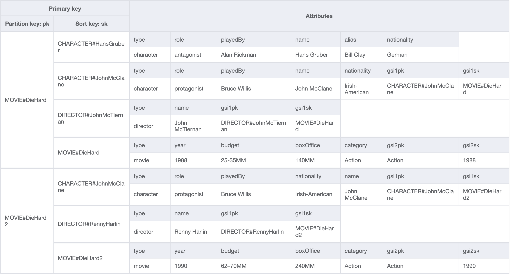
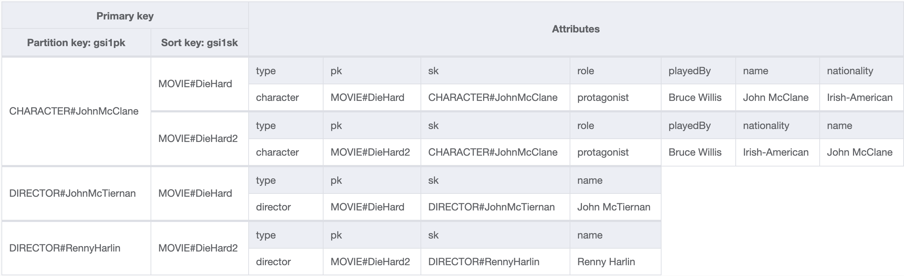
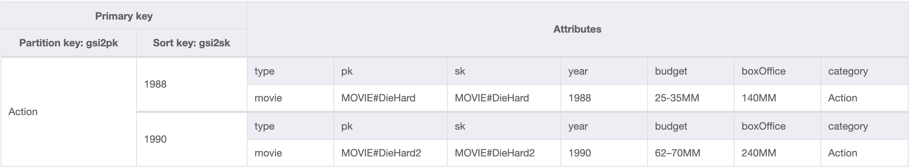

# MovieApi

Serverless movie api example using .net 6, AWS Lambda, DynamoDB, API Gateway and Serverless Framework.

## Prerequisites

* [.NET 6 SDK](https://dotnet.microsoft.com/en-us/download)
* [AWS Lambda for .NET Core](https://github.com/aws/aws-lambda-dotnet)
* [Serverless Framework](https://www.serverless.com/)
* [Docker](https://www.docker.com/products/docker-desktop/) _(Used for testing running DynamoDb)_
* Amazon.Lambda.Tools

```
dotnet tool install -g Amazon.Lambda.Tools
```

## Endpoints

List of REST endpoints exposed in API Gateway ([OpenAPI Specification](src/MovieApi/Schemas/openapi.yaml)):

| Paths | Method | Description|
| :---  | :---   | :---       |
|/movies|GET|Get all movies|
|/movies|POST|Create a movie|
|/movies/{movieId}|GET|Get a movie|
|/movies/{movieId}|PUT|Update a movie|
|/movies/{movieId}|DELETE|Delete a movie|
|/movies/{movieId}/characters|GET|Get movie characters|
|/movies/{movieId}/directors|GET|Get movie directors|
|/characters/{characterId}/movies|GET|Get character movies|
|/directors/{directorId}/movies|GET|Get director movies|

## Single Table Data Model

The domain objects in this example are stored in a single table, consisting of three entity types: MOVIE, CHARACTER, DIRECTOR.



| Access Patterns |Table/GSI/LSI|Key Condition|Filter Expression| Example|
| :---        | :---         | :---     | :---    |:---|
|Get movie for a given movieId|Table|pk=movieId and sk=movieId|-|pk="MOVIE#DieHard" and sk="MOVIE#DieHard"|
|Get characters for a given movieId|Table|pk=movieId and sk begins_with "CHARACTER#"|-|pk="MOVIE#DieHard" and sk begins_with "CHARACTER#"|
|Get directors for a given movieId|Table|pk=movieId and sk begins_with "DIRECTOR#"|-|pk="MOVIE#DieHard" and sk begins_with "DIRECTOR#"|

### Global Secondary Index (GSI1)



| Access Patterns |Table/GSI/LSI|Key Condition|Filter Expression| Example|
| :---        | :---         | :---     | :---    |:---|
|Get movies for a given characterId|GSI1|gsi1pk=characterId and SK begins_with "MOVIE#"|-|gsi1pk="CHARACTER#JohnMcClane" and gsi1sk begins_with "MOVIE#"|
|Get movies for a given directorId|GSI1|gsi1pk=directorId and SK begins_with "MOVIE#"|-|gsi1pk="DIRECTOR#JohnMcTiernan" and gsi1sk begins_with "MOVIE#"|

### Global Secondary Index (GSI2)



| Access Patterns |Table/GSI/LSI|Key Condition|Filter Expression| Example|
| :---        | :---         | :---     | :---    |:---|
|Get movies for a given category and year range|GSI2|gsi2pk=category and gsi2sk between year and year|-|gsi2pk="Action" and gsi2sk between 1988 and 1990|

## Observability
Using AWS X-Ray for tracing and Serilog for structured logging storing logs in AWS CloudWatch. 
Enabling logs and tracing in [Honeycomb](https://www.honeycomb.io/) via [Lambda Layers integration](https://docs.honeycomb.io/getting-data-in/integrations/aws/aws-lambda/). Honeycomb integration is configured in serverless.yml:

```
layers:
    - arn:aws:lambda:eu-north-1:702835727665:layer:honeycomb-lambda-extension-x86_64:9
environment:
    LIBHONEY_DATASET: MovieApi
    LIBHONEY_API_KEY: ${ssm:/aws/reference/secretsmanager/dev/MovieApi/LIBHONEY_API_KEY}
    LOGS_API_DISABLE_PLATFORM_MSGS: true
```
_API key referenced through AWS Secrets Manager. AWS Lambda Runtime Logs are excluded in Honeycomb via LOGS_API_DISABLE_PLATFORM_MSGS variable._

## Quality 

### Documentation

* **API documentation** in OpenAPI Specification v3.0.0.
* **Technical documentation** TODO class, deployment, dependency diagrams.
* **Code documentation** TODO inline code comments.

### Testing
High level unit testing of Lambda functions together with local DynamoDB instance spinning up in Docker using Testcontainers. DynamoDB table created and seeded using serverless framework configuration. Verify is a great library to assert complex test responses and easily setup and modify the expected results using the configured diff tool.

* [xUnit](https://xunit.net/)
* [Testcontainers](https://www.testcontainers.org/) using the [dotnet library](https://github.com/testcontainers/testcontainers-dotnet)
* [Verify](https://github.com/VerifyTests/Verify)
* [Bogus](https://github.com/bchavez/Bogus)

### Static Code Analyzers
Using .NET source code analysis which is enabled by default, and the following third-party analyzers:

* [SecurityCodeScan.VS2019](https://security-code-scan.github.io/)
* [SonarAnalyzer.CSharp](https://github.com/SonarSource/sonar-dotnet)
* [StyleCop.Analyzers](https://github.com/DotNetAnalyzers/StyleCopAnalyzers)

### Software Bill Of Materials (SBOM)
Generating SBOM using [CycloneDX](https://cyclonedx.org/) in a GitHub Actions [step](https://github.com/marketplace/actions/cyclonedx-net-generate-sbom). SBOM file generated by GitHub actions is added to repository. Optionally, install as a [dotnet cli tool](https://github.com/CycloneDX/cyclonedx-dotnet) and run locally:

```
dotnet tool install -g CycloneDX
dotnet CycloneDX src/MovieApi/MovieApi.csproj -o sbom -r
```

## References
1. [Velocity Template Language (VTL) reference](https://velocity.apache.org/engine/devel/vtl-reference.html)
2. [YAML over multiple lines](https://stackoverflow.com/questions/3790454/how-do-i-break-a-string-in-yaml-over-multiple-lines)
3. [JSON schema draft 4](https://datatracker.ietf.org/doc/html/draft-zyp-json-schema-04)
4. [OpenAPI specification v3.0.0](https://spec.openapis.org/oas/v3.0.0)
5. [API Gateway template variables](https://docs.aws.amazon.com/apigateway/latest/developerguide/api-gateway-mapping-template-reference.html)
6. [API Gateway proxy vs non-proxy Lambda integration](https://medium.com/@lakshmanLD/lambda-proxy-vs-lambda-integration-in-aws-api-gateway-3a9397af0e6d)
7. [.NET source code analysis](https://docs.microsoft.com/en-us/dotnet/fundamentals/code-analysis/overview)
8. [AWS Serverless Application Model](https://docs.aws.amazon.com/serverless-application-model/latest/developerguide/what-is-sam.html)
9. [Building Lambda functions with C#](https://docs.aws.amazon.com/lambda/latest/dg/lambda-csharp.html)
10. [Amazon DynamoDB Developer Guide](https://docs.aws.amazon.com/amazondynamodb/latest/developerguide/Introduction.html)